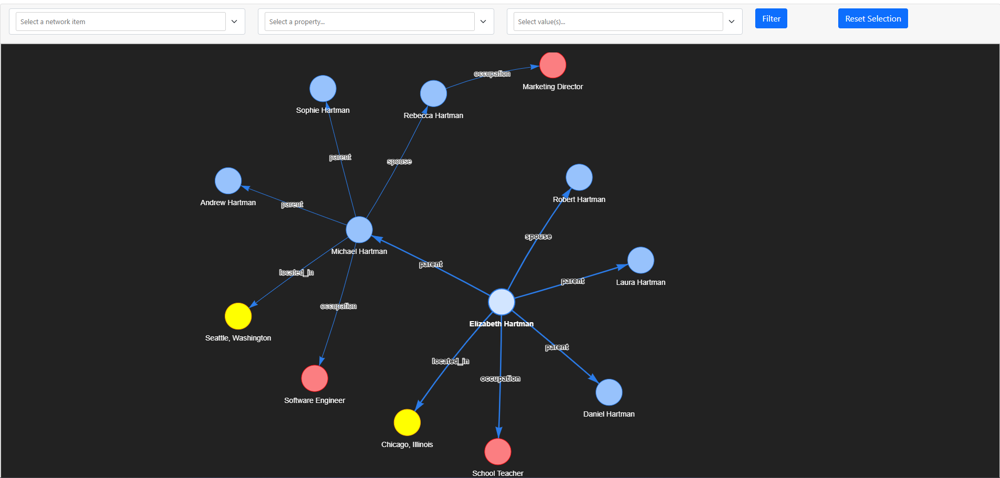

# Graph RAG Knowledge Visualizer

A powerful Python application that combines **Knowledge Graph Generation** with **Graph RAG (Retrieval-Augmented Generation)** to extract structured knowledge from unstructured text, visualize it as interactive graphs, and query it using natural language.



_Interactive knowledge graph visualization with AI-powered Q&A capabilities_

## 🚀 Features

### Knowledge Graph Generation

- **AI-Powered Extraction**: Uses OpenAI GPT models to automatically identify entities, relationships, and concepts from text
- **Interactive Visualizations**: Beautiful, physics-based network graphs using PyVis
- **Multiple Input Methods**: Support for file upload (.txt), direct text input, and example data
- **Customizable Schemas**: Define allowed node types and relationship patterns for structured extraction
- **Async Processing**: High-performance asynchronous text processing with automatic chunking

### Graph RAG (Question Answering)

- **Natural Language Queries**: Ask questions about your knowledge graph in plain English
- **Semantic Search**: Finds relevant entities and relationships using vector similarity
- **Context-Aware Answers**: LLM generates answers based on retrieved graph context
- **Confidence Scoring**: See confidence levels for each answer
- **Source Tracking**: View which entities and relationships contributed to the answer

## 📋 Requirements

- Python 3.11+
- OpenAI API key
- Internet connection for LLM and visualization libraries

## 🛠️ Installation

**Note**: This project uses [uv](https://github.com/astral-sh/uv) as the recommended dependency manager.

### Option 1: Using uv (Recommended)

1. **Install uv** (if not already installed)

   ```bash
   # On Windows
   powershell -c "irm https://astral.sh/uv/install.ps1 | iex"

   # On macOS/Linux
   curl -LsSf https://astral.sh/uv/install.sh | sh
   ```

2. **Clone and setup**

   ```bash
   git clone https://github.com/mcikalmerdeka/graph-rag-knowledge-visualizer
   cd knowledge-graph-visualizer
   ```

3. **Install dependencies with uv**

   ```bash
   uv sync
   ```

4. **Activate the virtual environment**

   ```bash
   uv shell
   ```

5. **Set up OpenAI API key**

   ```bash
   echo "OPENAI_API_KEY=your_api_key_here" > .env
   ```

### Option 2: Traditional pip

1. **Clone the repository**

   ```bash
   git clone https://github.com/mcikalmerdeka/graph-rag-knowledge-visualizer
   cd knowledge-graph-visualizer
   ```

2. **Set up virtual environment**

   ```bash
   python -m venv .venv
   source .venv/bin/activate  # On Windows: .venv\Scripts\activate
   ```

3. **Install dependencies**

   ```bash
   pip install -e .
   ```

4. **Set up OpenAI API key**

   ```bash
   echo "OPENAI_API_KEY=your_api_key_here" > .env
   ```

## 📦 Dependencies

- **Core ML**: `langchain`, `langchain-experimental`, `langchain-openai`, `openai`
- **Visualization**: `pyvis` (interactive graphs), `streamlit` (web interface)
- **Data Processing**: `numpy`, `pandas`
- **Utilities**: `python-dotenv`, `networkx`, `scikit-learn`

## 🎯 Usage

### Main Application (Streamlit Web App)

The primary way to use the application is through the Streamlit web interface:

```bash
# Using uv (recommended)
uv run streamlit run app.py

# Or using pip virtual environment
streamlit run app.py
```

The web interface provides two main sections:

**Section 1: Generate Knowledge Graph**

- Upload .txt files or paste text directly
- Select from example files in the sidebar
- Extract knowledge graphs automatically
- View interactive visualizations
- See graph statistics (nodes, relationships, types)

**Section 2: Ask Questions (Graph RAG)**

- Query the knowledge graph using natural language
- Get AI-generated answers with confidence scores
- View retrieved context and relevant entities

### Python API

You can also use the application programmatically:

```python
from src.main import KnowledgeGraphGenerator
from src.core.graph_rag import create_graph_rag

# Generate knowledge graph
generator = KnowledgeGraphGenerator()
text = "Your text here..."
graphs = generator.generate_sync(text)

# Create Graph RAG for Q&A
rag = create_graph_rag(graphs[0])

# Query the graph
result = rag.query("What are the main entities?")
print(result['answer'])
print(f"Confidence: {result['confidence']:.0%}")
```

## 📊 Example Data

The repository includes simplified example files in the `data/` folder:

- `elon_musk_profile.txt` - Profile of Elon Musk and his companies
- `diabetes_medical_knowledge.txt` - Medical information about diabetes
- `automotive_supply_chain.txt` - Automotive industry supply chain
- `mergers_acquisitions_legal.txt` - M&A legal framework overview
- `family_tree.txt` - Example family relationships

## 🔧 Architecture

### Core Components

1. **`src/main.py`** - High-level API
   - `KnowledgeGraphGenerator` class
   - Schema-based extraction support
   - Batch processing and merging capabilities
   - Async/sync generation methods

2. **`src/core/graph_transformer.py`** - Graph Extraction
   - LLM-powered entity and relationship extraction
   - Schema validation and enforcement
   - Property extraction from text
   - Statistics and metrics calculation

3. **`src/core/visualization.py`** - Visualization Engine
   - PyVis-based interactive graph rendering
   - Color-coded nodes by type
   - Physics-based force-directed layouts
   - HTML export for sharing

4. **`src/core/graph_rag.py`** - Graph RAG System
   - Vector-based semantic search over entities
   - Graph traversal for context expansion
   - LLM answer generation with citations
   - Confidence scoring and source tracking

5. **`app.py`** - Streamlit Web Interface
   - Two-section layout: Graph Generation + Graph RAG
   - File upload and text input
   - Sidebar with example file selection
   - Real-time visualization display
   - Interactive Q&A interface

### Data Flow

**Knowledge Graph Generation:**

```
Text Input → LLM Graph Transformer → Entity/Relationship Extraction → PyVis Visualization → Interactive HTML
```

**Graph RAG Query:**

```
User Question → Semantic Search (Entity Matching) → Graph Traversal → Context Extraction → LLM → Natural Language Answer
```

## 🎨 Visualization Features

- **Physics-based Layout**: Force-directed graph with customizable physics
- **Node Grouping**: Color-coded by entity type (Person, Organization, Product, etc.)
- **Interactive Controls**: Zoom, pan, drag nodes, filter menu
- **Edge Labels**: Relationship types clearly visible
- **Responsive Design**: Works on desktop and mobile
- **Dark Theme**: Professional appearance with high contrast

## 🔍 Advanced Features

### Custom Schema Definition

Define specific node types and relationships for structured extraction:

```python
from src.models.graph_models import GraphSchema

schema = GraphSchema(
    allowed_nodes=["Person", "Organization", "Product"],
    allowed_relationships=[
        ("Person", "WORKS_AT", "Organization"),
        ("Person", "FOUNDER", "Organization"),
        ("Organization", "PRODUCES", "Product"),
    ],
    node_properties=["role", "date"],
    strict_mode=True,
)

generator = KnowledgeGraphGenerator(schema=schema)
```

### Batch Processing

Process multiple texts and merge results:

```python
texts = [text1, text2, text3]
graphs = generator.generate_sync(texts)
merged = generator.merge(graphs)
```

### Long Text Handling

Automatic chunking for long documents:

```python
graphs = generator.generate_sync(
    long_text,
    chunk_size=800,
    chunk_overlap=150
)
```

## 📁 Project Structure

```
knowledge-graph-visualizer/
├── src/                           # Source code
│   ├── config/settings.py         # Configuration management
│   ├── core/                      # Core functionality
│   │   ├── graph_transformer.py   # LLM graph extraction
│   │   ├── visualization.py       # PyVis visualization
│   │   └── graph_rag.py          # Graph RAG Q&A system
│   ├── models/graph_models.py    # Data models (Node, Relationship, GraphDocument)
│   ├── utils/helpers.py          # Utility functions
│   ├── exceptions/               # Custom exceptions
│   └── main.py                   # High-level API
├── tests/                        # Unit test suite
│   ├── test_graph_transformer.py
│   ├── test_visualization.py
│   └── test_utils.py
├── data/                         # Example text files
│   ├── elon_musk_profile.txt
│   ├── diabetes_medical_knowledge.txt
│   ├── automotive_supply_chain.txt
│   ├── mergers_acquisitions_legal.txt
│   └── family_tree.txt
├── output/                       # Generated visualizations (auto-created)
├── app.py                        # 🎯 Main entry point - Streamlit web app
├── pyproject.toml               # Project configuration
├── requirements.txt             # Dependencies
├── .env                         # Environment variables (create this)
└── README.md                    # This file
```

## 🧪 Testing

Run the test suite:

```bash
# Using uv
uv run pytest tests/

# Using pip
pytest tests/
```

Tests cover:

- Graph transformation and extraction
- Visualization generation
- Utility functions (chunking, merging, JSON operations)

## 🚀 Performance Tips

- **Chunk Size**: For long texts (>1000 characters), the system automatically chunks text. Adjust `chunk_size` based on your content.
- **Model Selection**: Use `gpt-4.1-mini` for faster, cheaper extraction (default). Upgrade to `gpt-4` for complex texts.
- **Caching**: Reuse `KnowledgeGraphGenerator` instances for multiple extractions to benefit from connection pooling.
- **Async Processing**: Use `generator.generate()` (async) for batch processing multiple files concurrently.

## 🔒 Security & Privacy

- API keys stored in local `.env` file (never commit this file)
- No data sent to external services except OpenAI API
- All processing happens locally except LLM calls
- Generated visualizations are local HTML files
- No user data persistence or tracking

## 🛠️ Troubleshooting

**OpenAI API Errors:**

- Verify your API key in `.env` file
- Check API key has sufficient credits
- Ensure key has access to GPT-4 models

**Visualization Not Loading:**

- PyVis auto-downloads dependencies on first use
- Check internet connection for initial setup
- Try refreshing the browser page

**Out of Memory:**

- Reduce `chunk_size` for very long texts
- Process files individually instead of batching
- Clear output folder periodically

## 🤝 Contributing

1. Fork the repository
2. Create a feature branch (`git checkout -b feature/amazing-feature`)
3. Add tests for new functionality
4. Commit your changes (`git commit -m 'Add amazing feature'`)
5. Push to the branch (`git push origin feature/amazing-feature`)
6. Open a Pull Request

## 📄 License

This project is open source and available under the MIT License.

## 🙏 Acknowledgments

- **LangChain** for the graph transformation framework
- **OpenAI** for the GPT models powering extraction and Q&A
- **PyVis** for the interactive visualization engine
- **Streamlit** for the web application framework
- **NetworkX** for graph analysis and traversal

## 📞 Support

For issues, questions, or contributions:

1. Check existing issues in the repository
2. Create a new issue with:
   - Detailed description
   - Steps to reproduce
   - Error messages
   - Sample data (if applicable)
